# CuSphere
Student project selection and Admin Management System (Crafted by code, driven by curiosity. Explore every team's innovation — filter by subject, section, or technology to discover what's being built.)
<div align="center">


# 🎓 CuSphere — Student Project Management Platform

### *Crafted by code, driven by curiosity.*

**A centralized platform to manage academic projects across subjects, sections, and departments.**  
Students can select projects, form teams, submit files, and collaborate — all in one place.

[🚀 Live Demo](https://cusphere.netlify.app/) • [📖 Documentation](#features) • [🐛 Report Bug](../../issues) • [✨ Request Feature](../../issues)

</div>

---

## 📋 Table of Contents

- [About the Project](#-about-the-project)
- [Features](#-features)
- [Screenshots](#-screenshots)
- [Tech Stack](#-tech-stack)
- [Getting Started](#-getting-started)
- [Environment Variables](#-environment-variables-env)
- [Project Structure](#-project-structure)
- [Usage Guide](#-usage-guide)
- [Admin Panel](#-admin-panel)
- [Database Schema](#-database-schema)
- [Contributing](#-contributing)
- [License](#-license)

---

## 🧠 About the Project

**CuSphere** (formerly ProjectSphere) is a full-stack academic project management system built for **Chandigarh University's Innovation Hub**. It allows faculty administrators to manage subject-wise project allocations, and students to register teams, browse projects, submit presentations & reports, and give feedback — all through a clean, modern interface.

> **400+ Active Users · 10+ Clubs & Societies · 120+ Study Groups · 1 College**

---

## ✨ Features

### 👨‍🎓 Student Side
- **Public Dashboard** — View all registered teams, filter by subject/section/technology
- **Team Registration** — Form teams of 1–3 members, select subject, section, and project
- **Project Submission** — Upload PPT and Report files per subject and group
- **AI-Powered Chatbot** — Context-aware assistant for registration, project help, and support
- **Feedback Center** — Submit ratings & reviews; view aggregated feedback from all users
- **Suggestions Panel** — Submit feature suggestions and track their review status
- **Tutorial Popup** — Step-by-step onboarding guide for new users
- **Notification Bell** — Real-time announcements from admin
- **About Page** — Platform stats, mission, vision, and club listings

### 🔐 Admin Side
- **Secure Admin Login** — Protected dashboard with email/password auth
- **Admin Dashboard** — Stats cards: Total Teams, Section A/B, Projects, Submissions
- **Manage Subjects** — Add, edit, delete subjects dynamically
- **Add Projects** — Manually add projects with number, title, subject, and description
- **Import Projects via CSV** — Bulk upload projects using structured CSV format
- **Export to Excel (.xlsx)** — Export Teams or Submissions filtered by subject and section
- **Notification Manager** — Broadcast announcements to all students
- **Submissions Viewer** — Review all uploaded PPT/Report submissions

---

## 📸 Screenshots

### 🏠 Public Dashboard
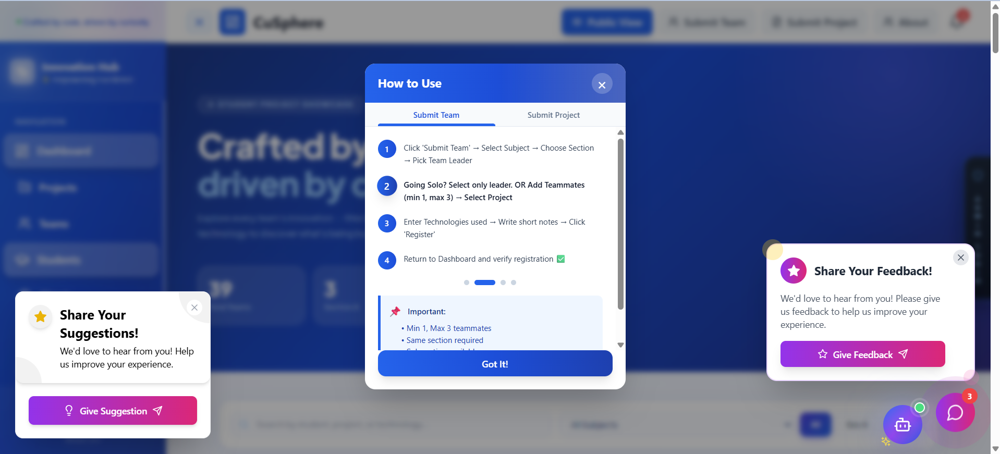
> The hero section showing total teams (39), Section A (3), and Section B (36) with search and filter functionality.

---

### 🤖 AI Project Assistant (Chatbot)
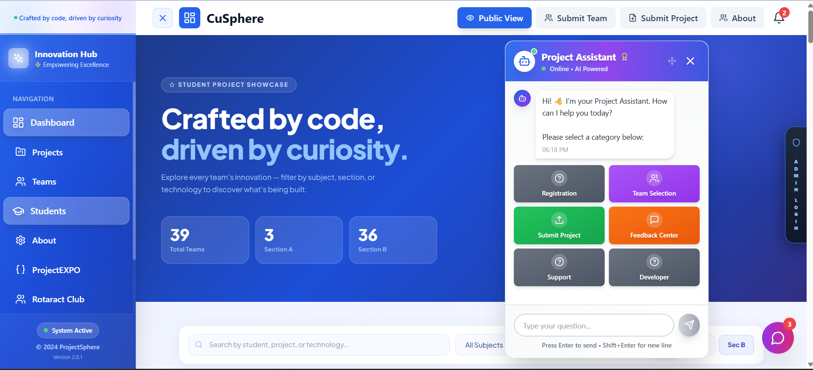
> AI-powered chatbot with category buttons: Registration, Team Selection, Submit Project, Feedback Center, Support, and Developer.

---

### 👥 Team Registration
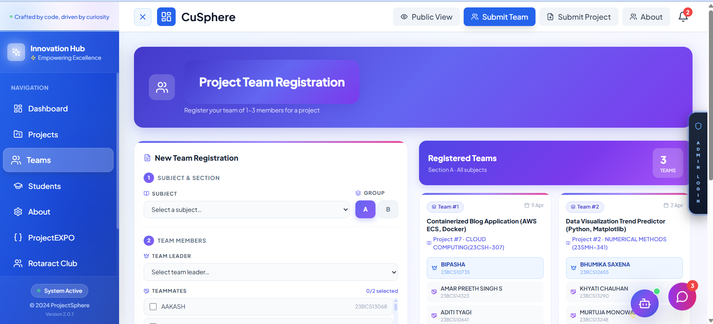
> Students register teams by selecting subject, group (A/B), team leader, and teammates. Registered teams appear on the right panel in real time.

---

### 📁 Project Submission
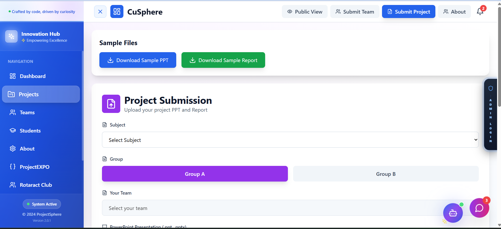
> Students upload their PowerPoint Presentation (.ppt/.pptx) and Report, with sample file downloads available.

---

### 🌐 Clubs & Communities
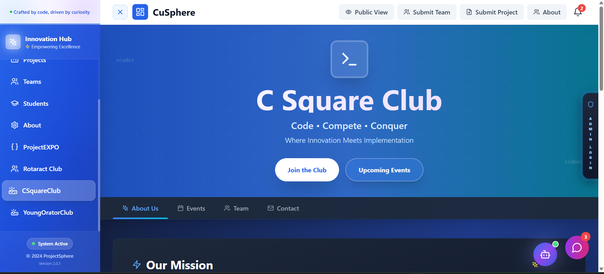
>A coding-focused community interface showcasing innovation and technical collaboration.
Includes sections like About, Events, Team, and Contact with clear actions such as Join the Club and Upcoming Events.

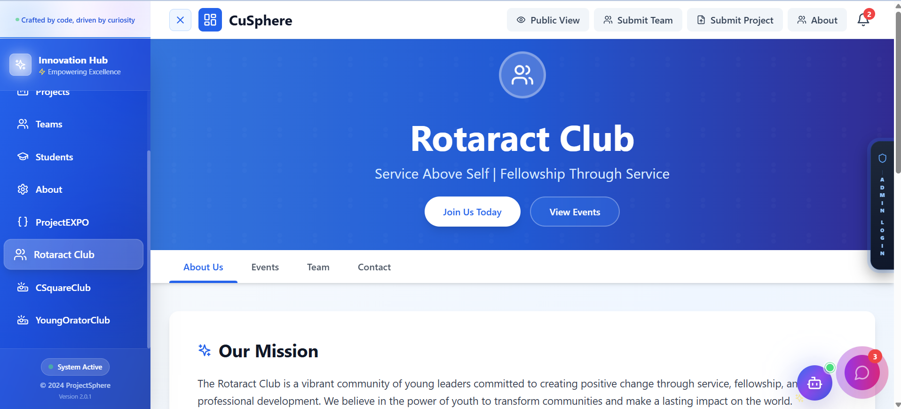
>A service-driven platform promoting leadership, community engagement, and social impact.
Highlights mission-oriented content with options like Join Us Today and View Events for active participation.

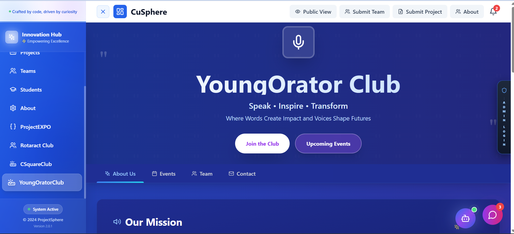
> A public speaking and communication platform designed to inspire confidence and expression.
Features event participation, team collaboration, and actions like Join the Club and Upcoming Events.

### ⭐ Feedback Center
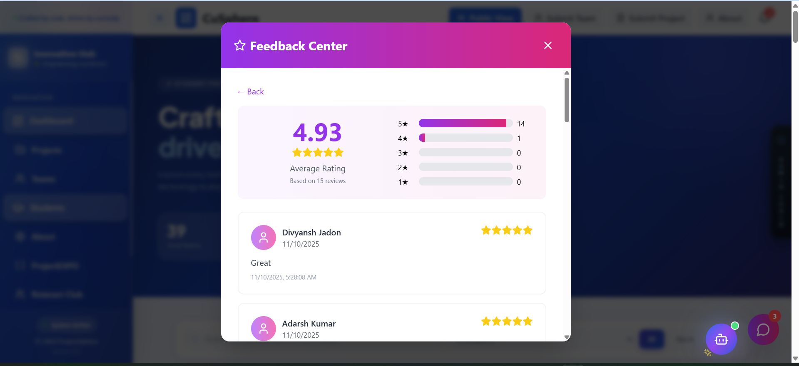
> Two options: Submit Feedback or View all ratings & reviews (15 total shown).

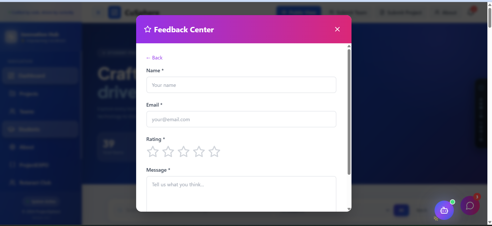
> Feedback form with Name, Email, Star Rating, and Message fields.

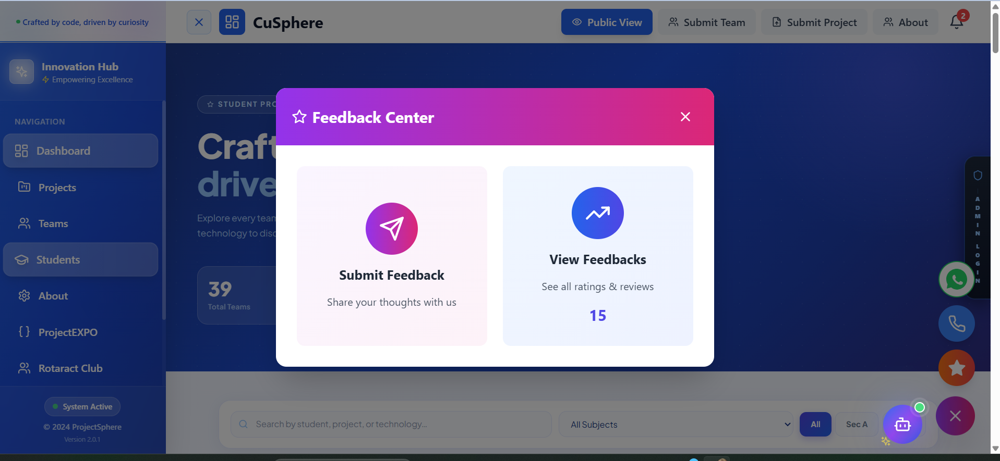
> Aggregated rating view: 4.93 average from 15 reviews, with individual review cards.

---

### 💡 Suggestions Panel
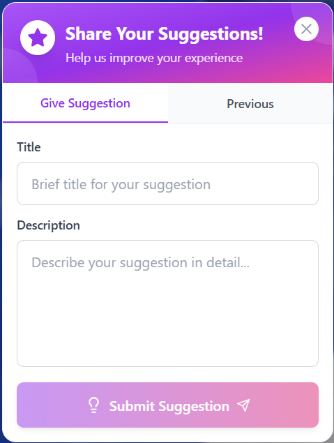
> Submit suggestions with a title and description via a popup form.

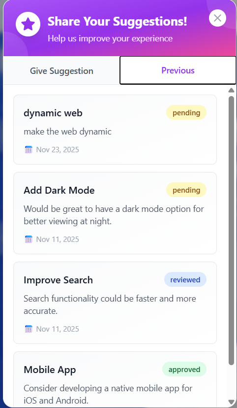
> View previously submitted suggestions with status badges: `pending`, `reviewed`, `approved`.

---

### 📖 Tutorial & Onboarding
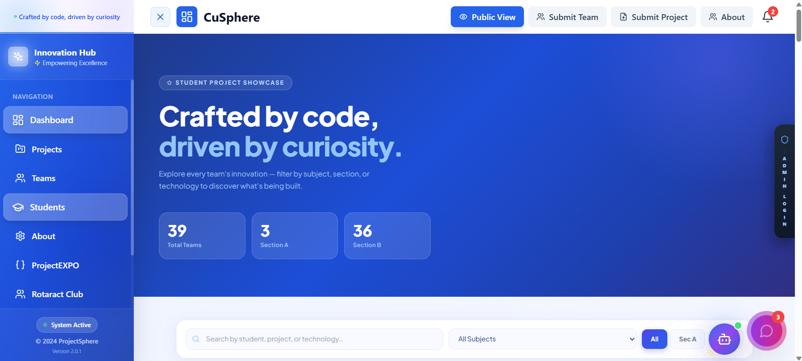
> Step-by-step "How to Use" guide with Submit Team and Submit Project tabs. Also shows the feedback and suggestion popups.

---

### ℹ️ About Page
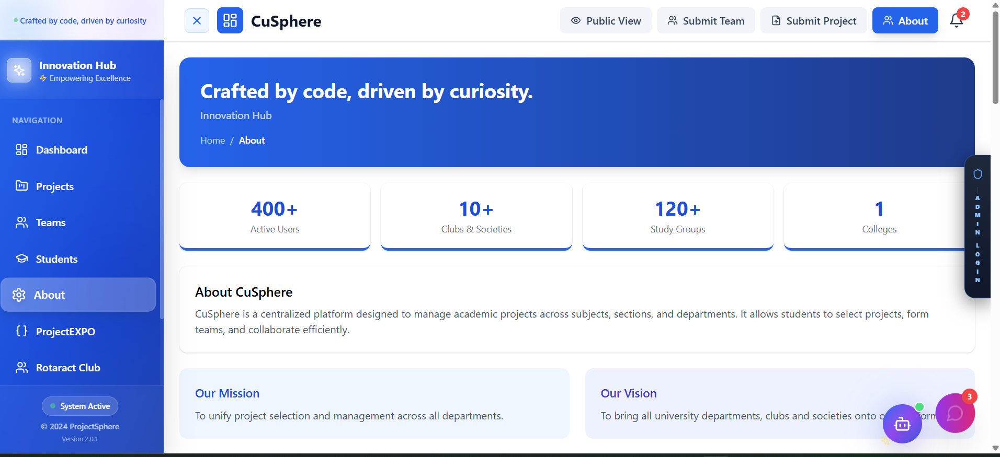
> Platform overview with stats, mission, vision, and club listings under Innovation Hub.

---

### 🔐 Admin Login
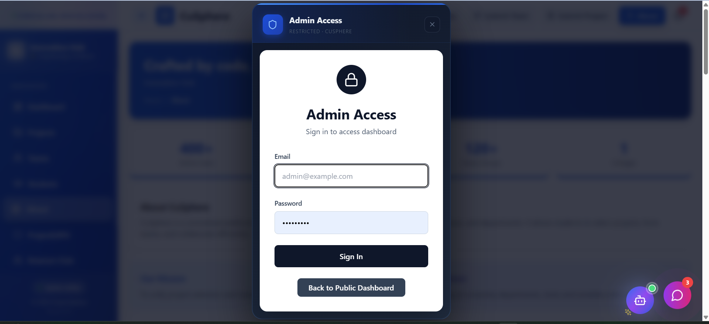
> Restricted admin access modal with email/password authentication.

---

### 🛠️ Admin Dashboard
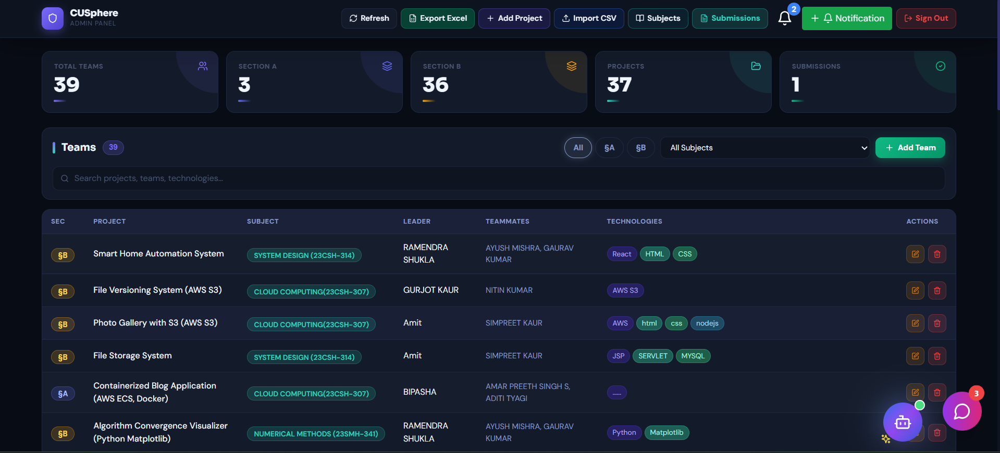
> Full admin panel with stats cards, team table (section, project, subject, leader, teammates, technologies), and action buttons.

---

### 📊 Export to Excel
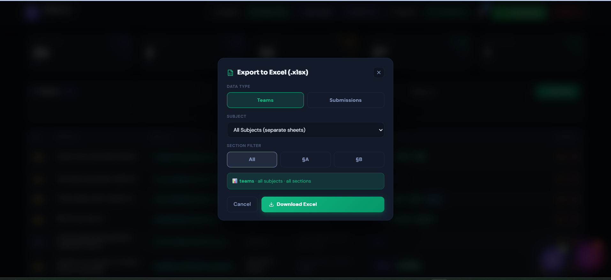
> Export Teams or Submissions filtered by subject (all or individual) and section (All, §A, §B) as `.xlsx`.

---

### ➕ Add New Project
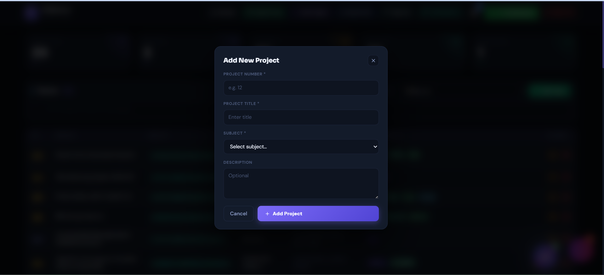
> Admin modal to manually add a project: Project Number, Title, Subject dropdown, and Description.

---

### 📥 Import Projects via CSV
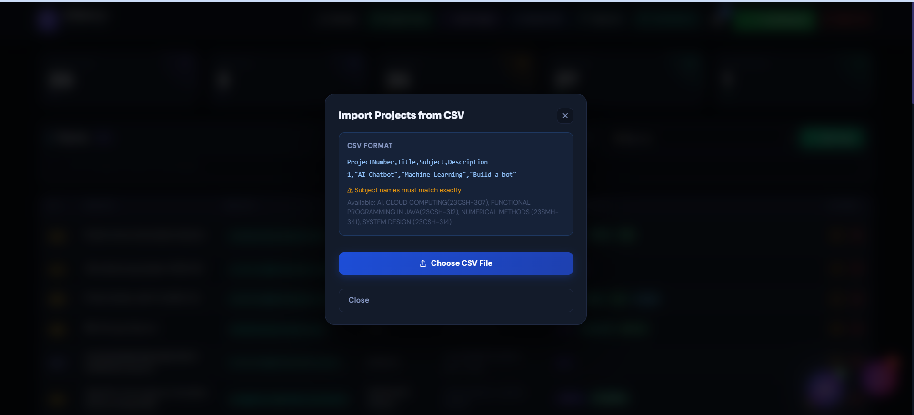
> Bulk import projects using CSV. Format: `ProjectNumber,Title,Subject,Description`. Subject names must match exactly.

---

### 📚 Manage Subjects
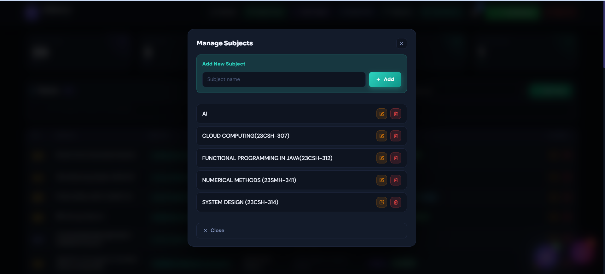
> Add new subjects and edit/delete existing ones (AI, Cloud Computing, Functional Programming in Java, Numerical Methods, System Design).

---

## 🛠 Tech Stack

| Layer | Technology |
|-------|-----------|
| Frontend | React 18 + TypeScript |
| Build Tool | Vite |
| Styling | Tailwind CSS |
| Backend / DB | Supabase (PostgreSQL) |
| Auth | Supabase Auth |
| File Storage | Supabase Storage |
| Excel Export | SheetJS (xlsx) |
| Deployment | Vercel / Netlify |

---

## 🚀 Getting Started

### Prerequisites

Make sure you have the following installed:

- **Node.js** v18+ → [Download](https://nodejs.org/)
- **npm** v9+ (comes with Node.js)
- A **Supabase** account → [supabase.com](https://supabase.com)

### Installation

**1. Clone the repository**
```bash
git clone https://github.com/YOUR_USERNAME/cusphere.git
cd cusphere
```

**2. Install dependencies**
```bash
npm install
```

**3. Set up environment variables**

Create a `.env` file in the root of the project (see next section):
```bash
cp .env.example .env
```
Then fill in your Supabase credentials.

**4. Set up the database**

Run the migration SQL in your Supabase SQL Editor:
```bash
# File location:
supabase/migrations/20251024134708_create_student_project_system.sql
```
Open Supabase → SQL Editor → Paste the file contents → Run.

**5. Start the development server**
```bash
npm run dev
```

The app will be available at **http://localhost:5173**

**6. Build for production**
```bash
npm run build
```

---

## 🔐 Environment Variables (`.env`)

Create a `.env` file in the **root** of your project with the following variables:

```env
# ============================================================
# CuSphere — Environment Configuration
# ============================================================
# Copy this file to .env and fill in your values.
# NEVER commit your actual .env file to GitHub!
# ============================================================

# ---------------------------
# Supabase Configuration
# ---------------------------
# Get these from: https://supabase.com → Your Project → Settings → API

VITE_SUPABASE_URL=https://your-project-id.supabase.co
VITE_SUPABASE_ANON_KEY=your-anon-public-key-here

# ---------------------------
# Admin Credentials
# ---------------------------
# Set these in Supabase Auth (Authentication → Users → Add User)
# Then hardcode the email below for admin panel gating (optional)

VITE_ADMIN_EMAIL=admin@yourdomain.com

# ---------------------------
# App Configuration (Optional)
# ---------------------------
VITE_APP_NAME=CuSphere
VITE_APP_VERSION=2.0.1
```

> ⚠️ **Important:** The `.env` file is listed in `.gitignore`. Never push real credentials to GitHub. Add `.env` to `.gitignore` if not already present.

### How to get your Supabase keys:

1. Go to [supabase.com](https://supabase.com) and open your project
2. Navigate to **Settings → API**
3. Copy the **Project URL** → paste as `VITE_SUPABASE_URL`
4. Copy the **anon / public** key → paste as `VITE_SUPABASE_ANON_KEY`

### `.env.example` file (commit this to GitHub)

Create a `.env.example` file for other developers:
```env
VITE_SUPABASE_URL=https://your-project-id.supabase.co
VITE_SUPABASE_ANON_KEY=your-anon-public-key-here
VITE_ADMIN_EMAIL=admin@yourdomain.com
VITE_APP_NAME=CuSphere
VITE_APP_VERSION=2.0.1
```

---

##  Project Structure

```
cusphere/
├── public/
│   └── samples/
│       ├── Report_Format.pdf          # Sample report for students
│       └── sample-presentation.pptx  # Sample PPT for students
│
├── screenshots/                       # All UI screenshots for README
│
├── src/
│   ├── App.tsx                        # Root app component & routing
│   ├── main.tsx                       # Entry point
│   ├── index.css                      # Global styles
│   │
│   ├── components/
│   │   ├── about.tsx                  # About page
│   │   ├── AdminDashboard.tsx         # Admin panel (protected)
│   │   ├── AdminNotificationManager.tsx # Broadcast notifications
│   │   ├── AuthContext.tsx            # Auth state management
│   │   ├── Chatbot.tsx                # AI-powered chatbot widget
│   │   ├── CSquareClub.tsx            # C² Club page
│   │   ├── LoginForm.tsx              # Admin login modal
│   │   ├── NotificationBell.tsx       # Notification icon + dropdown
│   │   ├── ProjectExpo.tsx            # ProjectEXPO page
│   │   ├── ProjectSubmissionForm.tsx  # PPT/Report upload form
│   │   ├── PublicDisplay.tsx          # Public dashboard (student view)
│   │   ├── RotaractClub.tsx           # Rotaract Club page
│   │   ├── Sidebar.tsx                # Left navigation sidebar
│   │   ├── SidebarContext.tsx         # Sidebar open/close state
│   │   ├── SuggestionPopup.tsx        # Suggestion submission widget
│   │   ├── TeamSubmissionForm.tsx     # Team registration form
│   │   ├── TutorialPopup.tsx          # Onboarding how-to popup
│   │   ├── WhatsAppPhoneWidget.tsx    # WhatsApp contact widget
│   │   └── YoungOratorClub.tsx        # Young Orator Club page
│   │
│   └── lib/
│       └── supabase.ts                # Supabase client initialization
│
├── supabase/
│   └── migrations/
│       └── 20251024134708_create_student_project_system.sql
│
├── .env                               # ← YOUR secrets (never commit)
├── .env.example                       # ← Template (safe to commit)
├── .gitignore
├── package.json
├── tsconfig.json
├── vite.config.ts
└── README.md
```

---

## 📖 Usage Guide

### For Students

**Register your team:**
1. Click **Submit Team** in the top navbar
2. Select your **Subject** and **Group** (A or B)
3. Choose your **Team Leader** from the student list
4. Add **Teammates** (1–3 members, same section required)
5. Select your **Project** from the dropdown
6. Enter **Technologies Used** and optional notes
7. Click **Register** — your team appears on the public dashboard instantly

**Submit your project files:**
1. Click **Submit Project** in the top navbar
2. Select **Subject**, **Group**, and your **Team**
3. Upload **PowerPoint Presentation** (.ppt or .pptx)
4. Upload **Project Report** (PDF format)
5. Click **Submit**

**Need help?**  
Click the 🤖 **Chatbot** button at the bottom right and select a category.

---

### CSV Import Format (Admin)

To bulk import projects, prepare a `.csv` file in this exact format:

```csv
ProjectNumber,Title,Subject,Description
1,"AI Chatbot","Machine Learning","Build a conversational bot"
2,"Smart Home System","SYSTEM DESIGN (23CSH-314)","IoT-based automation"
3,"File Storage on AWS","CLOUD COMPUTING(23CSH-307)","S3-based file management"
```

> ⚠️ Subject names must **exactly match** the subjects listed in the system.

---

## 🛠 Admin Panel

Access the admin panel via the **ADMIN LOGIN** tab on the right edge of any page.

| Feature | Description |
|---------|-------------|
| Dashboard Stats | Total Teams, Section A, Section B, Projects, Submissions |
| Manage Subjects | Add / Edit / Delete subjects |
| Add Project | Create individual projects with number, title, subject |
| Import CSV | Bulk-upload projects from a CSV file |
| Export Excel | Download team or submission data filtered by subject/section |
| Notifications | Send broadcast announcements to all students |
| Submissions | View all uploaded PPT and Report files |

---

## 🗄 Database Schema

The main tables created by the migration:

| Table | Purpose |
|-------|---------|
| `subjects` | Stores all academic subjects |
| `projects` | Available projects per subject |
| `students` | Student directory (name, roll number) |
| `teams` | Registered teams with leader, teammates, technologies |
| `submissions` | Uploaded PPT/Report files per team |
| `notifications` | Admin-broadcast announcements |
| `feedback` | Student ratings and reviews |
| `suggestions` | Feature suggestions with status tracking |

Run the full schema from:
```
supabase/migrations/20251024134708_create_student_project_system.sql
```

---

##  Contributing

Contributions are welcome! Here's how:

1. Fork the repository
2. Create a feature branch: `git checkout -b feature/amazing-feature`
3. Commit your changes: `git commit -m 'Add amazing feature'`
4. Push to the branch: `git push origin feature/amazing-feature`
5. Open a Pull Request

---

## 📄 License

Distributed under the MIT License. See `LICENSE` for more information.

---

<div align="center">

**Built with  at Chandigarh University — Innovation Hub**

*© 2024 CuSphere · Version 2.0.1*

</div>
